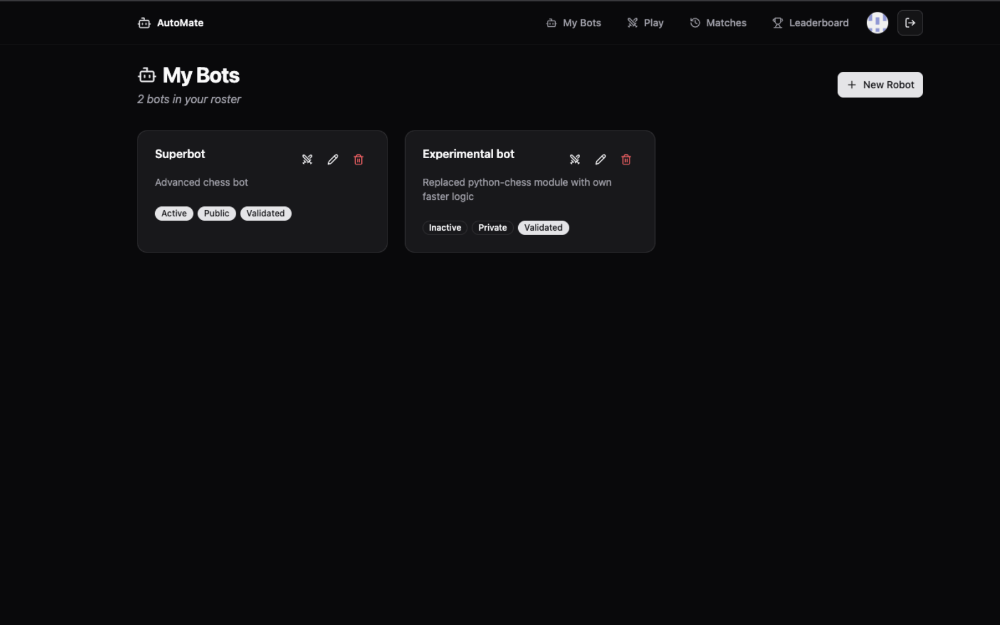
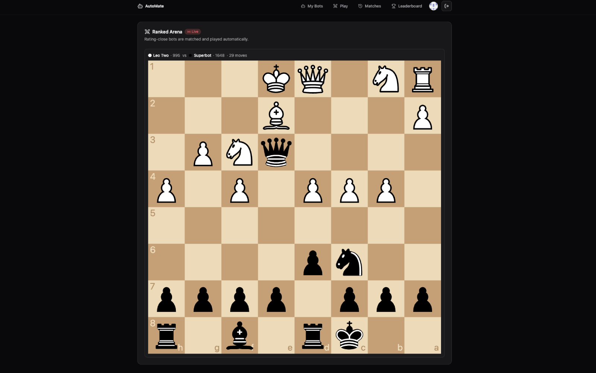
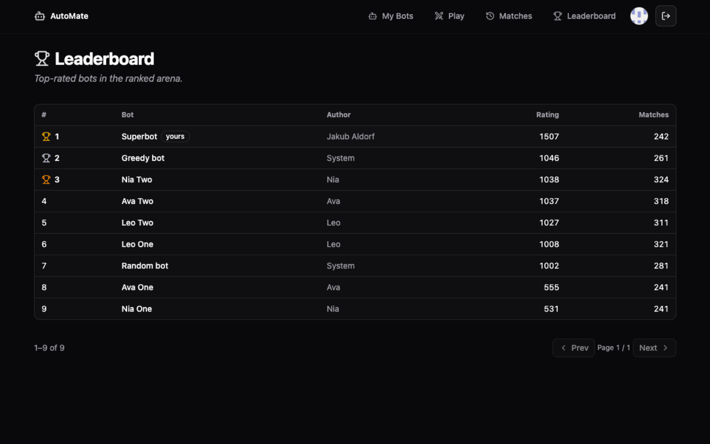
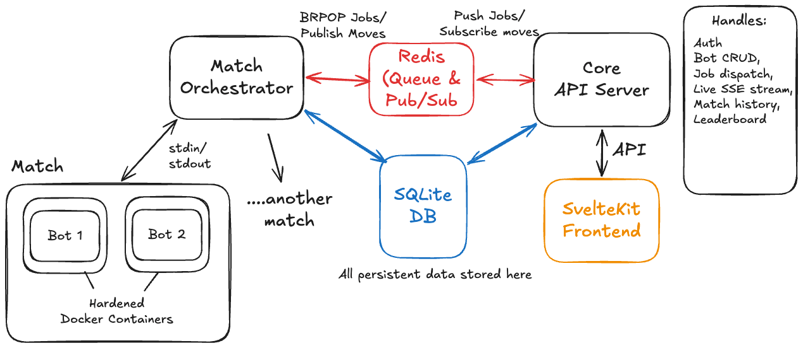

# AutoMate

> **An automated arena where user-submitted Python bots duel in real-time chess.** Write a `get_chess_move(fen)` function, submit it via the web UI, and watch it climb a live ELO ladder. Untrusted code executes inside hardened Docker sandboxes with zero network access and strict hardware limits.

[](https://github.com/aldorfjakub/automate/actions/workflows/ci.yml)
[](LICENSE)

Inspired by [Sebastian Lague's Chess Coding Challenge](https://www.youtube.com/watch?v=Ne40a5LkK6A), this project reimagines the concept as a full-stack, distributed web platform—adding untrusted-code isolation, automated ELO matchmaking, live Server-Sent Events (SSE) streaming, and match replays.

---


## Interface

| Bot Management & Roster | Live Match Arena (SSE) |
| :---: | :---: |
|  |  |
| *Manage bots and check validation status.* | *Real-time move streaming & live board.* |

| Global ELO Leaderboard |
| :---: |
|  |
| *Live rankings updated automatically after every ranked match.* |

---

## System Architecture

The web gateway is decoupled from match execution through a Redis job queue so compute-heavy bot loops never block web traffic.

<p align="center">
  
</p>

* **`backend/` (API Gateway):** Rust (Axum). Handles GitHub OAuth, bot CRUD, the background ELO matchmaker, and the live `GET /api/matches/{id}/watch` SSE stream. Never executes user code.
* **`orchestrator/` (Referee Worker):** Rust daemon. Pulls match tickets via Redis `BRPOP`, manages Docker sandboxes, enforces turn clocks via `stdin`/`stdout`, and computes ELO deltas.
* **Storage & Broker:** **SQLite (WAL mode)** for persistent application state; **Redis** for the job queue and sub-second live move broadcasting.

---

## The Bot Contract

Bots are single-file Python 3.12 modules evaluated with `python-chess`:

```python
import chess

def get_chess_move(fen: str) -> str:
    board = chess.Board(fen)
    return list(board.legal_moves)[0].uci()
```

* **Constraints:** Must return a legal UCI move (e.g. `e2e4`) within **1.2 seconds**.
* **Warm Containers:** The container process stays alive across turns; states and moves are streamed over `stdin`/`stdout` pipes to eliminate interpreter startup overhead.

---

## Security & Sandboxing

Because user code is hostile by default, each bot runs isolated inside Docker:
* **Zero Network:** `--network=none` disables all inbound/outbound traffic.
* **Locked Filesystem:** `--read-only` root with a small scratch `tmpfs`.
* **Privilege Drops:** `--cap-drop=ALL` and `--security-opt=no-new-privileges`.
* **Resource Caps:** Hard-limited to 256 MB RAM, 0.5 CPU, and a 64-process ceiling.
* **The "Ghost Match" Gate:** New code must go through validation, a synthetic 20-move game against a benchmark bot before entering ranked play. Timeouts, exceptions, or illegal moves reject the submission immediately.

---

## Known Bottlenecks & Future Improvements

* **SQLite Single-Writer Limit:** SQLite is optimal for single-host simplicity and fast local reads, but concurrent write bursts (multiple matches finishing simultaneously) require careful busy-timeout tuning. The data layer uses `sqlx`, so migrating to **PostgreSQL** is the clear path for high write-concurrency.
* **Single-Node Execution:** The current orchestrator and API gateway share the same physical server. Because they communicate strictly via Redis, the system is designed to scale horizontally by deploying worker daemons onto dedicated, private compute VPS nodes.
* **Kernel Sandboxing:** While Docker flags enforce strict containment, moving to **gVisor (`runsc`)** or microVMs (Firecracker) would provide an additional virtualized kernel boundary against zero-day Linux kernel vulnerabilities.

---

## Local Setup

**Prerequisites:** Rust, Node 20+, Docker.

```bash
# 1. Start Redis & build sandbox image
make dev

# 2. Configure environment (set GitHub OAuth credentials)
cp backend/.env.example backend/.env

# 3. Run services (3 terminal windows)
cd backend      && cargo run     # API on http://127.0.0.1:3000
cd orchestrator && cargo run     # Referee worker daemon
cd frontend     && npm run dev   # SvelteKit UI on http://localhost:5173
```

**Testing:** `make test` (Rust unit tests) · `make lint` (clippy + fmt) · `make check` (svelte-check)

---

## License

Distributed under the [MIT License](LICENSE). Built with Axum, SvelteKit, SQLite, and Redis.